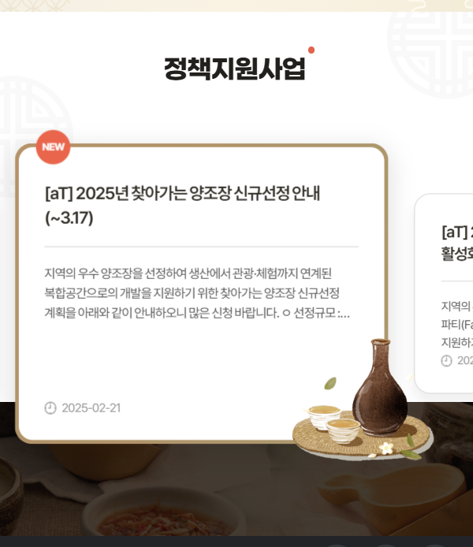
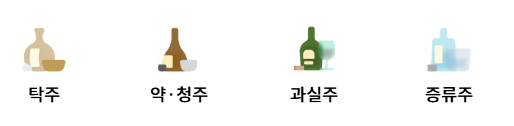

# DDD 하자

**사용자가 사이트에 들어왔다**

## 1. 메인 페이지에 들어왔다.

### 메인페이지에 뭐가 나와?

- 전통주 간단 소개

이는, 배너를 뜻함.
아래 그림은 슬라이드 형태로 되어 있는데,  
슬라이드 형태가 아닌 전통주를 알리는 사진 딱 하나만 고정되어 있으면 좋겠음!

#### PC화면 배너

#### 모바일 화면

- 오늘의 술
- 양조장 지역 소개
- 누룩 소개

## 혜성님 아이디어: 양조장 지역 소개

지역 소개를 한다고 했잖아요?
지역 소개보다는, 술이 만들어지는 과정을 담는 페이지는 어떨까요?

술을 눌렀을 때, 이 술의 기준을 명인이 아닌 어떤 지역의 양조장으로
포커스를 맞추자

1. 와인같은것도 명인을 포커스로 두기는 보다는 장인이나 명인을 포커스로 가지 않잖아요?
2. 해당 지역의 특산물로 소개를 하지 명인으로 소개를 하지 않아요.
3. 안동 소주도 예를 들면 "안동"이라고 설명을 하지 명인을 소개하지는 않잖아요?

그러면 차라리 양조장 지역 소개를 하는데 그것도 양조장 지역의 술을 소개하겠다
그래서 카테고리를 지역 별 소개 => 양조장 지역 소개

1. 맵 구현하고
2. 해당 지역을 선택
3. 양조장 나옴

### 혜성님 아이디어 정리

양조장 지역 소개로 간다.

카테고리를 지역 별 소개 => 양조장 지역 소개

1. 맵 구현하고
2. 해당 지역을 선택
3. 양조장 나옴

## 2. 오늘의 술을 클릭했다.

### 술 목록

#### 조상아 의견

술 목록이 그냥 쫘르륵 나오는게 아니라 술도 종류가 있음.  
카테고리를 나누어서 클릭할 수 있게.

## 3. 양조장 지역소개

1. 구글 맵

양조장까지 나오고 해당 양조장을 클릭했을 때,  
2번이 바로 아래 화면에 표시됨.

2. 해당 양조장의 술 목록

## 4. 술 상세 페이지

1. 술 관련 정보

## 5. 로그인 팝업창

1. 누룩 관련 소개 페이지
