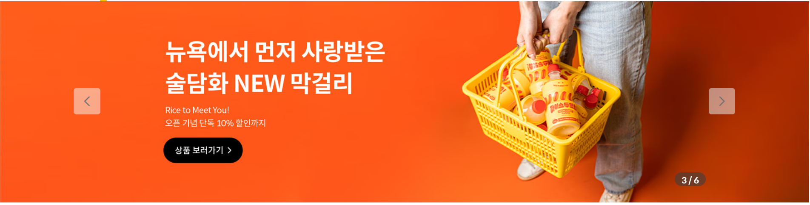

# DDD 하자

**사용자가 사이트에 들어왔다**

## 1. 메인 페이지에 들어왔다.

### 메인페이지에 뭐가 나와?

- 전통주 간단 소개

이는, 배너를 뜻함.
아래 그림은 슬라이드 형태로 되어 있는데,  
슬라이드 형태가 아닌 전통주를 알리는 사진 딱 하나만 고정되어 있으면 좋겠음!

#### PC화면 배너

#### 모바일 화면

- 오늘의 술
- 양조장 지역 소개
- 누룩 소개

**누 룩은 무엇을 소개하나요?**

단순히 `누룩` 이라는 우리의 사이트 소개가 아님.  
누룩이라는 단어가 가진 뜻과 우리의 정체성을 결합한 것을 소개하는 공간

## 2. 오늘의 술을 클릭했다.

### 술 목록

#### 조상아 의견

술 목록이 그냥 쫘르륵 나오는게 아니라 술도 종류가 있음.  
카테고리를 나누어서 클릭할 수 있게.

## 3. 술 상세 페이지

1. 술 관련 정보

## 4. 로그인 팝업창

1. 누룩 관련 소개 페이지

## 5. 예약

로그인 후 술 상세페이지에서 구매 대신에  
예약이랑 시간을 정할 수 있는데  
정해진 예약 날짜가 되면 오프라인에서 체험 할 수 있음.

그래서 예약이라는 도메인이 존재
시음하는지에 대한 주제가 들어있는것이 있어야 함.

1. 캘린더
2. 시간
3. 인원
4. 체험에 대한 비용 안내

## 6. 내 정보

술을 시음하려고 가는거잖아요.  
그 사람이 갔는데 술이 없어 그러면 당황.  
술을 준비할 수 있게끔 술 정보가 필요함.

- 내 닉네임
- 예약 확인
  - 내가 선택한 술
  - 시음 장소
  - 시간
  - 체험 비용 안내
