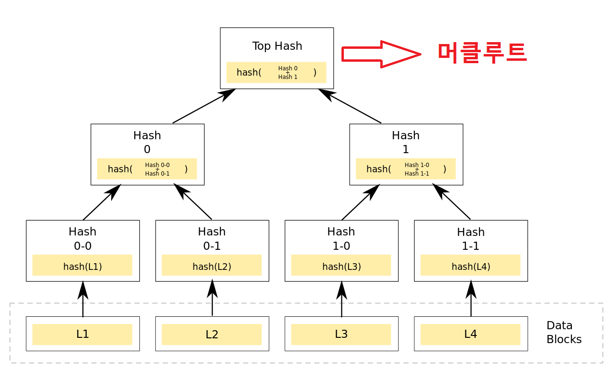

# 머클루트 (7.mercleroot.md)

해시는 단순히 문자열을 변환한것뿐임  
그런데 이걸로 '신뢰성 있는 검증'을 할 수 있을까?
즉, 암호화와는 직접적인 연관이 없다.
그럼 알고리즘을 통해서 암호화를 하는거임

=> 그 중 하나가 머클루트임.

## 머클루트란?

> “해시와 머클루트는 블록체인의 신뢰를 유지하는 **가장 우아한 구조**입니다.”

## 1. 해시와 머클루트: 하버드 졸업생의 성적표 이야기

하버드 졸업생 수천 명의 성적을 관리한다고 생각해봅시다.  
모두가 **성적을 조작하지 않았다는 걸 증명**해야 합니다.

그럼 방법은?

- A안: 모든 졸업생의 성적표를 하나하나 일일이 전화해서 확인
- B안: 전체 성적 데이터를 모아서 해시값 하나로 요약 → 이 값만 비교하면 검증 끝

**데이터를 조작하면 단 하나의 바이트라도 바뀌면, 이 지문도 완전히 달라집니다.**

---

## 2. 머클루트의 배경: 왜 이런 구조가 만들어졌을까?

**사토시 나카모토는 믿지 않았습니다.**  
정부, 은행, 중앙기관… 누구도 믿을 수 없다고 생각했습니다.  
그래서 **“아무도 믿지 않아도 되게 만드는 구조”**를 고안했죠.

그중 핵심이 **“누가 거래를 조작했는지 검증할 수 있는가?”**입니다.

- 모든 거래를 한 줄로 나열하고 비교? → 느리고 비효율적
- => 해결책: 머클 트리(Merkle Tree)라는 구조를 만들어서, **수천 개의 거래를 단 하나의 값(머클루트)**로 요약!

이 구조는 **1980년대에 이미 랠프 머클이라는 사람이 고안**했으며,  
사토시는 이것을 **비트코인에 적용**하였습니다.

---

## 3. 머클루트의 본질: 블록체인의 핵심 미학

머클루트는 단순한 해시값이 아닙니다.  
**“수천 개의 거래가 한 글자도 안 바뀌었음을 단 하나의 값으로 증명”**하는 구조입니다.

### 머클 트리 요약 흐름

1. 각각의 거래 데이터를 해시 (Tx1 → H1, Tx2 → H2, ...)
2. 해시값을 두 개씩 묶어 다시 해시 (H1+H2 → H12, H3+H4 → H34)
3. 계속 위로 해시를 반복하여 최종 하나의 값만 남음
4. 이 마지막 값이 바로 **Merkle Root (머클루트)**

## 4. 결론

머클루트 덕분에 우리는

- 거래 하나하나를 모두 열어보지 않아도
- 데이터를 빠르게, 정확하게, 효율적으로 검증하고
- 조작 여부를 수학적으로 확인할 수 있습니다.

=> **누구도 믿지 않아도 되는 시스템 => 문자열 하나로 확인 가능**,  
=> **신뢰가 아닌 수학으로 작동하는 신세계**,  
=> 그 구조의 중심에 있는 것이 바로 **머클루트**입니다.

---

> “해시는 지문이고,  
> 머클루트는 **집단의 진실을 단 하나의 값으로 증명하는 지문집합의 최상위 요약본**이다.”
