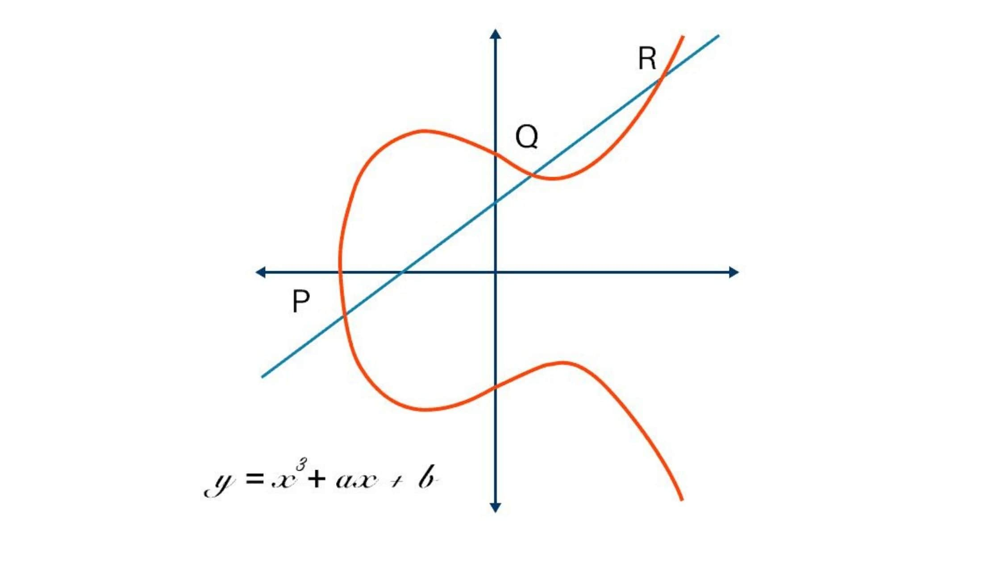

# ECC(Elliptic Curve Cryptography)를 그림과 동네 비유로 이해하기

## 1. 이 꾸불꾸불한 곡선이 뭘까?

우리가 보고 있는 이 붉은 곡선은 바로 **타원 곡선(Elliptic Curve)**입니다.  
정확한 수식은 `y² = x³ + ax + b` 형태이며,  
블록체인에서는 `a = 0`, `b = 7`인 **secp256k1** 곡선을 사용합니다.

## 2. 곡선 위의 점들은 덧셈이 가능합니다

예를 들어 점 P와 Q가 있다고 할 때,

1. 두 점을 잇는 직선을 그으면,
2. 이 직선이 곡선을 한 번 더 만나는 지점(R)이 생기고,
3. 이 점을 x축 기준으로 뒤집으면 → **P + Q**가 됩니다.

즉, **타원 곡선 위의 점들은 덧셈이 가능한 특별한 점들**입니다.

## 3. G는 출발점, 기준점입니다

ECC에서는 모두가 알고 있는 하나의 기준점 `G`가 있습니다.  
이 점은 **공개되어 있는 출발점**이며, **누구나 동일하게 알고 있는 위치**입니다.

## 4. 비밀키와 공개키는 이렇게 연결됩니다

- **비밀키 = G에서 이동할 횟수**
- **공개키 = 그 이동 결과, 도착 지점**

예를 들어:

- 비밀키가 2라면 → `G + G = 공개키`
- 비밀키가 5라면 → `G + G + G + G + G = 공개키`

결국,  
**공개키 = 비밀키 × G**  
→ 즉, **G를 비밀키만큼 반복해서 이동한 끝의 위치가 공개키입니다.**
