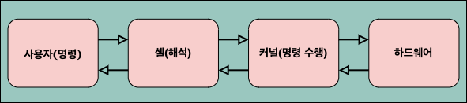

### 터미널 실행

터미널(명령 프롬프트)은 CLI(Command Line Interface)를 기반으로 동작함.
GUI처럼 시각적 요소가 없고, 명령어를 입력해서 작업을 수행합니다.

C:\Users\KGA>

### 위의 뜻은 무엇일까?

1. C:\

- C (Window 기준)드라이브 자체를 나타냅니다

2. C:\Users\

- C 드라이브 안에 있는 "Users" 폴더를 의미

3. C:\Users\KGA

- C 드라이브 안에 Users 폴더 안에 KGA(사용자 이름)까지의 경로를 뜻 함.

즉, 현재 터미널의 작업 공간(디렉토리)이 KGA(사용자 이름)폴더라는 뜻.

`echo`: 파일 생성 등등을 할 수 있는 명령어 
`mkdir`: `make directory`라는 뜻의 약자. 터미널에서 폴더를 생성하는 명령어
`cd`: `change directory` 라는 뜻의 약자.

### 잠깐 실습

echo, mkdir, cd

위의 세 가지 명령어를 통해서 다음 폴더 및 파일을 만드세요.

생성 폴더 이름: 6.git

생성 파일 이름(6.git폴더 안에 생성하세요): 

- index.html
- index.css
- index.js

### 여러분들이 컴퓨터에서 하는 행동들

- 컴퓨터 전원을 키기
- 로그인
- 마우스 움직이기
- 인터넷 아이콘 클릭해서 인터넷 "프로그램" 실행시키기
- vscode 실행시키기
- vscode내에서 폴더 및 파일 생성 그리고 코드 작성
- 컴퓨터 끄기

이 위에서 하는 행동들 전부를 실행시켜 주는 것의 주체가 OS(운영체제)입니다.  
운영체제가 없다면, 컴퓨터 전원을 키기부터 막힙니다.  

## OS(운영체제)란?  

컴퓨터의 모든 하드웨어와 소프트웨어를 관리하는 핵심 시스템

## OS 종류

- Window
- Linux
- Unix
- MacOs...

소프트웨어 : 손으로 만질 수 없는 것
엑셀, 크롬, 엣지, 하다못해 명령 프롬프트 => 소프트웨어다.

하드웨어 : 손으로 만질 수 있는것
컴퓨터 부품 => 램, 마우스, 키보드, 그래픽카드 등등...

## 리눅스 구조

1. 응용 프로그램: chrome, vscode, Zoom
2. 셸: 명령 해석기 => 명령을 해석하여 커널에 전달.
3. 커널: 셸에게 받은 명령 해석한 것을 하드웨어와 직접 통신함(전달함)

## 리눅스 명령 흐름

사용자(명령 내림) => 셸(명령 해석) => 커널(명령 수행) => 하드웨어

그리고 다시 사용자에게 전달함.
위 글에 이해를 돕기위해 아래의 그림을 첨부함.



## 리눅스 탄생 배경

- 1981년에 탄생한 운영체제가 있는데 => MS-DOS => GUI 제공 X
- 1985 => Window 1.0 => GUI가 탄생
=> Window 3.0 => Window 95

## 그럼 리눅스는?

UNIX => 1960년대 발명  
- 리누스 토르발스라는 사람이 학생 시절에 개발된 운영 체제다
=> 1990년대 초 학생 시절에 개발 => 리눅스
=> UNIX를 모방하여 만들었음.  

개발자들이 주로 사용한 운영체제였음.  
지금은 GUI도 제공하고 모바일로도 뻗어나간 운영체제.

## Ubuntu

리눅스 배포판 OS

- 좀 더 편리한 명령어들이 존재함

## WSL(Windows SubSystem for Linux)

리눅스(우분투)를 실행시키기 위한 가상 머신

## WSL 활성화 및 Ubuntu 설치

첫 번째 명령어

```sh
dism.exe /online /enable-feature /featurename:Microsoft-Windows-Subsystem-Linux /all /norestart
```

두 번째 명령어

```sh
dism.exe /online /enable-feature /featurename:VirtualMachinePlatform /all /norestart
```

- **첫 번째 명령어**: WSL을 활성화하여 Linux 환경을 처리할 준비를 합니다.  
- **두 번째 명령어**: WSL2에서 Linux 커널을 실행하기 위해 가상화 계층을 활성화합니다.  

가상 머신에 우분투 설치

## 우분투 디렉토리 구조

`mnt`: 다양한 디바이스(운영체제, 프로그램 등등)에 대한 폴더 및 파일에 접근 가능할 수 있게 제공되는 폴더
`bin`: 모든 사용자가 사용할 수 있는 기본적인 명령어가 저장된 디렉토리(폴더)
=> mkdir, cd, vi, ls, cp 등등...

나머지 디렉토리 설명은 다음 주 월요일에(머리 아프니깐 ㅎㅎ)

## 우분투 명령어

`cd`: `cd ..` 등등 cd 뒤에 텍스트를 작성하여 디렉토리(폴더)를 이동할 때 사용.
`ls`: `ls -a` => 현재 디렉토리 안의 내용을 확인한다.(숨김 파일까지 전부)
`mkdir`: `mkdir [디렉토리명]` 디렉토리 생성
=> `mkdir [경로]/[디렉토리명]` => 경로를 포함한 디렉토리명을 적으면 해당 경로에 디렉토리가 생성된다.
`vi`: vi 에디터 열기 => 파일 열기, 파일 내용을 추가, 수정할 수 있는 모드

- `i`: vi 에디터에서 입력 모드로 전환하는 명령어
(저장하거나 종료하려면 INSERT모드에서 반드시 빠져나와야 합니다 => ESC)

- :q > 일반 종료
- :q! > 강제 종료
- :w > 일반 저장
- :w! > 강제 저장    
- :wq! > 강제로 저장하고 종료

## 실습(5분짜리)

우분투의 경로를 수정하여 우리 수업폴더가 있는 공간을 찾아서 경로를 위치시켜 주세요.

