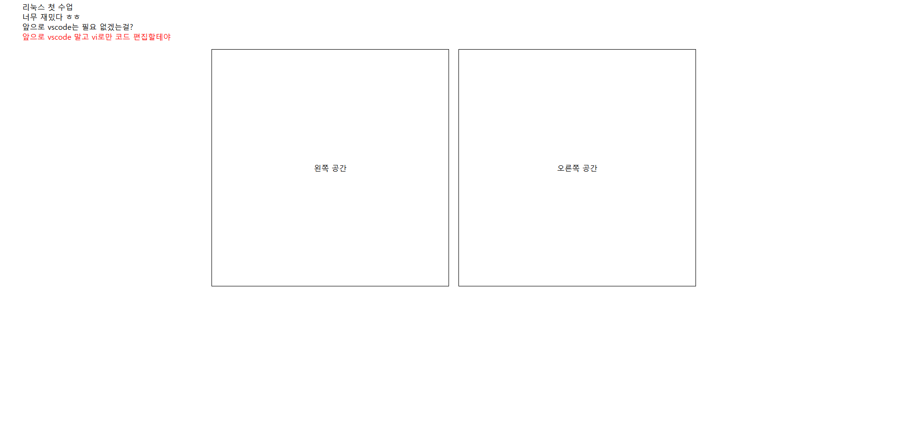

## 주말 과제2

### 주의 사항

아래의 과제들은 전부 터미널(Ubuntu)만 사용하여 진행하는 실습과제입니다. 
이번에는 화면이 나오게끔만 구현하면 됩니다.(무슨 명령어를 사용했는지는 안 써도 됨). 

## 결과물 구조

```sh
5.Linux/
├── study/
    ├── public/
        └── js/
            └── index.js
        └── css/
            └── index.css
    └── index.html
```

1. 5.Linux 폴더가 없다면 5.Linux폴더를 생성해주세요.
2. 5.Linux 폴더가 있다면 5.Linux 폴더 안에 study 폴더를 생성해주세요
3. study 폴더안에 index.html을 생성해주세요.
4. study 폴더안에 public 폴더를 생성하세요.
5. public 폴더 안에 각각 두 개의 폴더를 생성하세요. => css폴더, js폴더

### 예상 화면



위의 화면과 똑같이 구현해주시면 됩니다.  
단! 터미널(우분투)로만 코드를 작성하셔야 합니다!  

그리고 마지막 리스트 부분에서  
=> "앞으로 vscode 말고 vi로만 코드 편집할테야"  
부분은 js파일에서 요소를 생성하여 동적으로 HTML에 뿌려주세요.  

## 기한

12월 16일 수업 시작 전까지 제출하세요.  

## 저장 위치

공유 드라이브에 20241213_우분투_주말과제_결과물 폴더에 결과물을 저장해주세요  