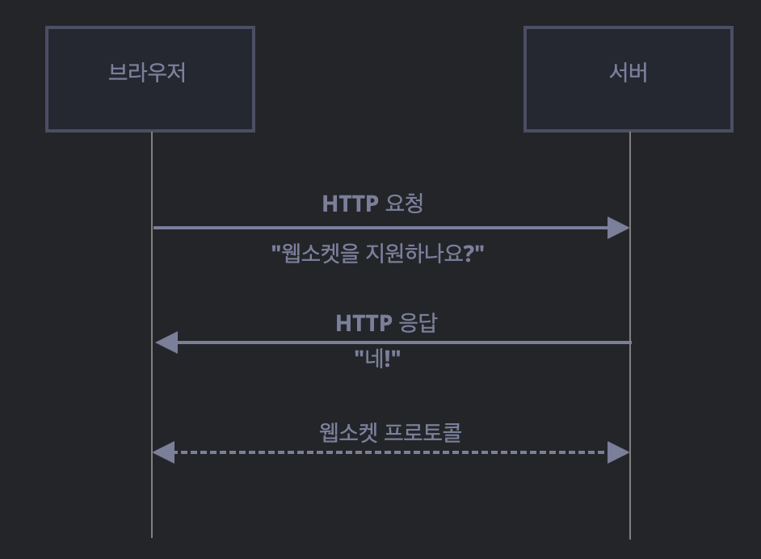

# 사전 준비

디렉토리 만듭니다.

- front
- back

각각의 디렉토리에 경로를 위치한 우분투(터미널) 2개를 켜주시고.

```sh
npm init -y
```

## 필요한 모듈 설치

front : express, nunjucks
back : express, ws

# 웹소켓 핸드셰이크

new WebSocket(url)을 호출해 소켓을 생성하면 즉시 연결이 시작됩니다.

커넥션이 유지되는 동안, 브라우저는 (헤더를 사용해) 서버에 '웹소켓을 지원하나요?'라고 물어봅니다.  
이에 서버가 '네’라는 응답을 하면 서버-브라우저간 통신은 HTTP가 아닌 웹소켓 프로토콜을 사용해 진행됩니다.



## message 기본 형태

WS라는 특수 프로토콜이기 때문에 request, response에 규칙성이 있다.

### request message 기본 형태

```
GET /
Host: 127.0.0.1:3000  // 실제 요청에는 Host 헤더도 포함
Connection: Upgrade
Upgrade: websocket
Sec-WebSocket-Key: Iv8io/9s+lYFgZWcXczP8Q==
Sec-WebSocket-Version: 13  // 브라우저가 지원하는 WebSocket 버전 (주로 13)
```

- Origin: 해당 요청이 발생한 도메인(프로토콜, 호스트, 포트)을 나타냄.
  서버는 Origin을 보고 요청 출처를 식별할 수 있음.
  웹소켓은 기본적으로 크로스 오리진을 허용하지만, 서버 측에서 Origin에 따라 통신을 제한할 수도 있음.
  오래된 서버는 웹소켓 통신을 지원하지 못하기 때문에 웹소켓 통신은 호환성 문제도 없습니다.
- Connection: Upgrade - 클라이언트 측에서 프로토콜을 바꾸고 싶다는 신호를 보냈다는 것을 나타냅니다.
- Upgrade: websocket – 클라이언트측에서 요청한 프로토콜은 'websocket’이라는걸 의미합니다.
- Sec-WebSocket-Key – 보안을 위해 브라우저에서 생성된 키로, 서버가 WebSocket 프로토콜을 지원하는지 확인하는 데 사용됩니다.  
  이 키는 무작위로 생성되며, 프록시가 이후의 통신을 캐싱하지 못하도록 방지하는 역할을 합니다. 고유식별자의 역할

### response message 기본 형태

```
HTTP/1.1 101 101 Switching Protocols
Upgrade: websocket
Connection: Upgrade
Sec-WebSocket-Accept: hsBlbuDTkk24srzEOTBUlZAlC2g=
```

- HTTP/1.1 101 Switching Protocols : 클라이언트의 프로토콜 업그레이드 요청을 승인했다는 의미.
- Sec-WebSocket-Accept : 서버가 Sec-WebSocket-Key에 특정 GUID(258EAFA5-E914-47DA-95CA-C5AB0DC85B11)를 덧붙인 뒤 SHA-1 해시를 구하고, Base64로 인코딩한 값.  
  클라이언트는 이 값이 자신이 보낸 Sec-WebSocket-Key에 대한 올바른 응답인지 확인함으로써 서버가 실제 WebSocket을 지원하는지를 검증함.

## 결론

핸드셰이크 후 시점이므로, 이제 HTTP 프로토콜이 아닌 WebSocket 프로토콜을 사용해 양방향 통신 준비 완

핸드셰이크 과정을 통해 서버와 클라이언트는 웹소켓 프로토콜로 통신할 준비를 마치게 됩니다.  
이후부터는 실시간 양방향 데이터를 자유롭게 주고받을 수 있습니다.

## 실시간 채팅 구현할겁니다!!

### 예제 시나리오: 실시간 채팅 서버

1. 3000번 포트(ws://)에 여러 클라이언트가 WebSocket으로 접속 중.
2. 어느 한 클라이언트가 메시지를 전체 클라이언트에게 보냄.
3. 서버는 메시지를 받은 후, 현재 접속한 모든 클라이언트에게 브로드캐스트(전송).
4. 모든 클라이언트가 서버로부터 메시지를 받아 실시간으로 표시.

### 1. front에서 메세지를 작성할 입력 폼(form, input) 작성