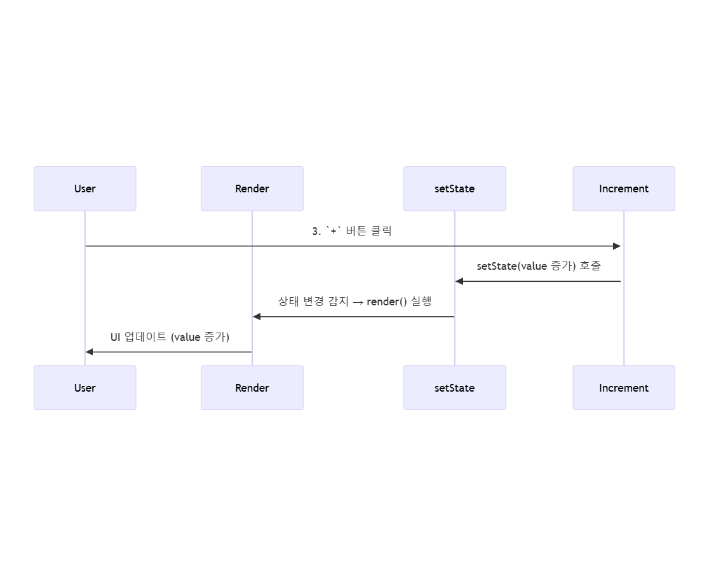

## 최초 실행 순서

1. constructor()가 실행되면서 상태의 value는 0이 상태가 된다.
2. value가 0인 상태로 render()가 실행된다.

## componentDidMount

3. 이후 Count 컴포넌트가 마운트 되면서, componentDidMount()가 호출되고
setState()에 의해서 value가 10으로 바뀐다.
4. 상태가 바뀌었으므로 render()를 실행하여 this.state.value가 10이 된다.

## `+` 버튼을 눌렀을 때 코드 실행 순서

5. onClick에 의해 increment() 호출이 된다.
6. this.state.value의 값이 변경되고, render()가 실행되면서 값이 업데이트 된다.

