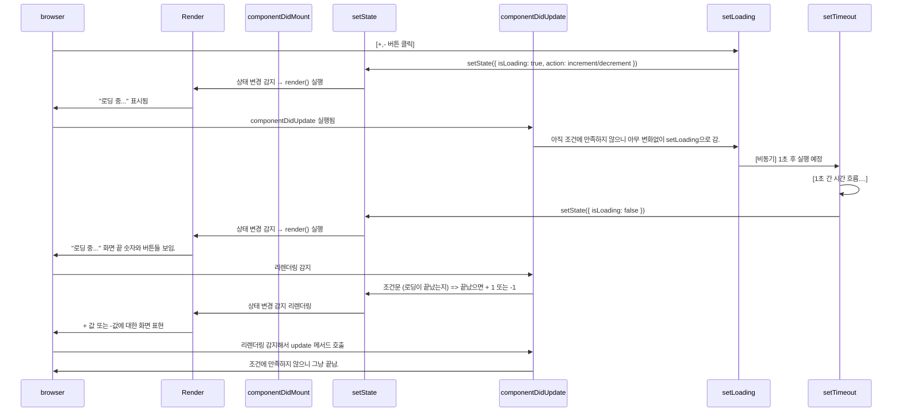

## 회고

### 오늘 뭐가 어려웠어?

- state, props에서 왜 props로 내려줘야 하지?

상태가 자식에 존재한다면, 부모는 자식의 상태를 모르니까.  
최대한, 상태를 부모에게 올려줘야 함.

```jsx
// 함수의 실행을 던진 것 => 클릭되었을 때 실행이 아닌, 렌더링 되었을 때 바로 실행됨
<Square onClick={this.handleClick(i)}/>
// 함수 값 자체를 던진 것 => 클릭되었을 때 실행이 됨.
<Square onClick={() => this.handleClick(i)}/>

// 차이점
```

리액트를 잘한다 => 내가 얘기해준 것들도 인지하는 것 좋아!
=> 리액트는 결국 javascript야!
=> 자바스크립트 기본기가 탄탄해야 잘해

