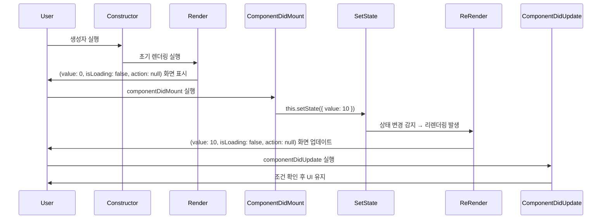
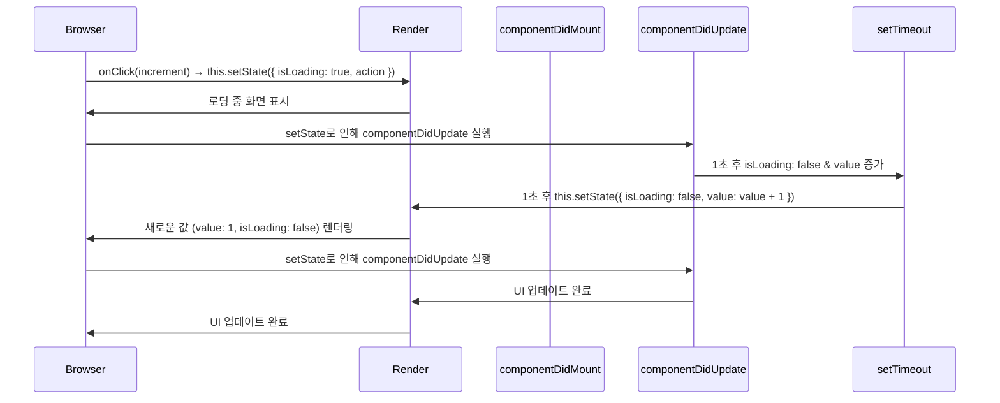
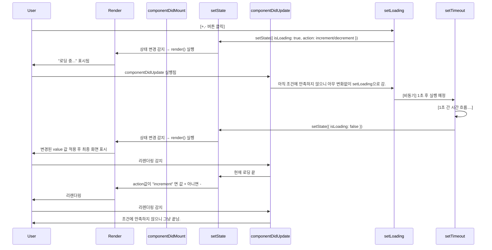

## 회고

### 오늘 뭐가 어려웠어?

혜성  

- 구조가 헷갈림

부모가 계속 아래에 있어서 헷갈림.  
근데 보충 수업으로 어느 정도 이해가 감.

- props이랑 onClick

onClick이벤트가 헷갈림 함수의 onClick이벤트

```jsx
<button onClick={this.props.onClick}></button>
```

약간....문법이 익숙하지 않아서
위의 onClick은 그냥 HTML 문법일 뿐인데....자바스크립트 문법
즉 => onClick = this.props.onClick
이거랑 헷갈렸다?

### JSX에서의 onClick은 HTML의 이벤트 속성이 아님. 리액트의 이벤트 객체를 기반으로 동작하는 속성

```js
const button = document.createElement("button");
button.textContent = "Click Me";
button.onclick = this.props.onClick; // 함수 할당 (실행 X)
document.body.appendChild(button);
```

✔️ 즉, onClick={this.props.onClick}은 button.onclick = this.props.onClick과 같은 역할을 함.
✔️ 중요한 점은 실행(())이 아니라, 함수 참조를 넘긴다는 것!


```jsx
onClick = () => {

}

() => {

}
<button onClick={onClick(i)}></button>
<button onClick={() => onClick(i)}></button>

const a = () => {
    return "나는 A!";
}

const b = a;

console.log(b);  // b는 a 함수 자체를 참조 (출력: ƒ () => { return "나는 A!" })
console.log(b()); // b() 실행 → "나는 A!"
```

onClick={onClick(i)}
=> onClick(i)가 즉시 실행됨 (❌ 잘못된 사용법)
=> 버튼이 렌더링 될 때 실행
=> 결과적으로 버튼을 클릭하기도 전에 onClick(i)가 실행되어버림.

onClick={() => onClick(i)}
=> 클릭할 때만 onClick(i)가 실행됨 (✅ 올바른 사용법)
=> 얘는 onClick에 함수 이벤트 등록 => 누를 때 이벤트 발동 즉, 함수 실행

## 주말 과제

### 최초 실행



### 증감 버튼 눌렀을 때


### 이후

