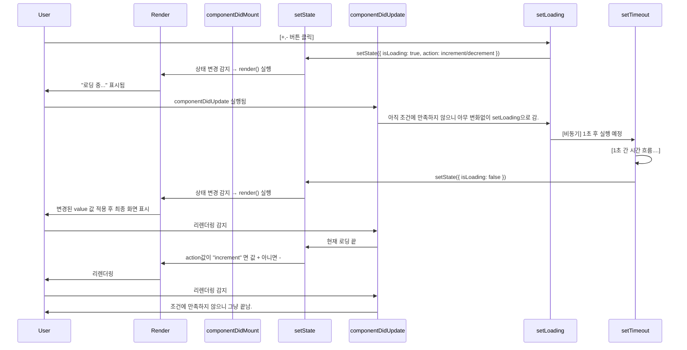

## 회고

### 오늘 뭐가 어려웠어?

```js
handleClick = () => {}
// onClick = handleClick
onClick = (onClick) => {}

onClick(handleClick)
```

### 왜 handle이라고 이름 붙힘?

이벤트(event): 사용자가 특정 동작(클릭, 입력, 스크롤 등)을 수행하는 것
이벤트 핸들러(event handler): 특정 이벤트가 발생했을 때 실행되는 함수
"이벤트 핸들러 함수"라고 부르는 이유는 해당 함수가 이벤트를 "처리(Handle)"하는 역할을 하기 때문 

즉, 그냥 함수인데 이벤트를 `눌렀`을 때 실행(handle)하는 함수라고 이름 붙힌 것.  

###

```jsx
onClick={this.handleClick(i)}
onClick={() => this.handleClick(i)}

const a = () => {
    return "나는 A!";
}

const b = a;

console.log(b);  // b는 a 함수 자체를 참조 (출력: ƒ () => { return "나는 A!" })
console.log(b()); // b() 실행 → "나는 A!"

function handleClick(i) {
    console.log(`Clicked: ${i}`);
}

// 즉시 실행됨
button.onclick = handleClick(3);  // 잘못된 코드 (handleClick(3) 즉시 실행)

// 클릭 시 실행됨
button.onclick = () => handleClick(3);  // 버튼 클릭 시 실행
```

